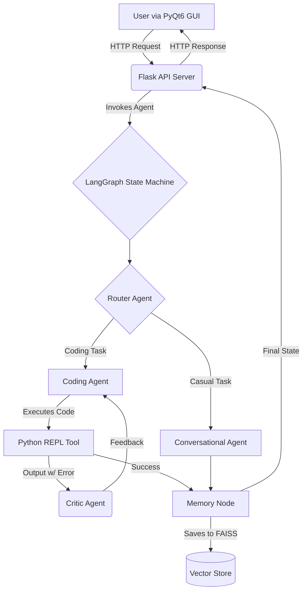

# Lex: An Autonomous AI Assistant 🤖

Lex is a multi-agent, autonomous desktop assistant built with a sophisticated agentic architecture. It's designed to go beyond simple conversation, enabling complex task execution, self-correction, and learning from past interactions through a persistent memory system.

---

## 🚀 Live Demo


How it Works : 


## Step - 1 : Load app.py


## Step - 2 : Load gui.py


## Step 3 : Activate Hot-Keys ['l' , 'e' , 'x'] to Activate the Multi Agent.


---

## ✨ Key Features

Lex isn't just a chatbot; it's a powerful agent with a unique set of capabilities:

*   **🧠 Multi-Agent Architecture:** A central "router" agent analyzes user prompts and delegates tasks to specialized agents—a conversational agent for Q&A and a coding agent for autonomous task execution on the host system.
*   **🛠️ Self-Correction Loop:** Lex can debug itself! A "Child" agent analyzes the code execution output for errors. If an error is found, it provides iterative feedback to the coding agent, allowing it to fix its own code and re-attempt the task.
*   **📚 RAG-Based Memory:** Equipped with a FAISS vector store, Lex has long-term memory. It can recall past interactions, learn user preferences, and provide contextually aware responses, becoming more personalized over time.
*   **🖥️ Full-Stack Desktop Application:** Lex is a complete application with a Flask API backend serving the agent's logic and a responsive, non-blocking PyQt6 GUI for a polished user experience.
*   **⚡ Hotkey Activated:** The GUI can be summoned and dismissed instantly with a global hotkey (`l` `e` `x`), making it a seamless part of any workflow.

---

## 🛠️ Tech Stack

This project leverages a modern, powerful stack to achieve its agentic capabilities:

*   **AI Core:** LangGraph, LangChain
*   **LLM:** Groq (Llama3-70b)
*   **Memory:** FAISS (Vector Store), SerpAPI (Web Search)
*   **Backend:** Python, Flask
*   **GUI:** PyQt6
*   **Tools:** Git, GitHub, VS Code

---

## 🏛️ Architecture Overview

Lex operates on a clear, modular architecture:

1.  **GUI (`gui.py`):** The user-facing interface, built with PyQt6. It captures user input and displays results in a non-blocking manner by running API calls in a separate thread.
2.  **API Server (`app.py`):** A lightweight Flask server that exposes the agent's functionality via a simple `/invoke` endpoint. It acts as the bridge between the GUI and the agent's brain.
3.  **Agent Brain (`Lex_Lang_Graph.py`):** The core of the application. It contains the LangGraph state machine, all the agent definitions (router, coder, critic), the memory system, and the tool integrations.



---

## 🚀 Getting Started

To get a local copy up and running, follow these simple steps.

### Prerequisites

*   Python 3.10+
*   An API key from [Groq](https://console.groq.com/keys)
*   An API key from [SerpAPI](https://serpapi.com/)

### Installation

1.  **Clone the repo**
    ```sh
    git clone https://github.com/akshayabalan/lex.git
    cd lex-agent
    ```
2.  **Install Python packages**
    ```sh
    pip install -r requirements.txt
    ```
3.  **Set up your environment variables**
    *   Create a file named `.env` in the root directory.
    *   Add your API keys to this file:
        ```env
        GROQ_API_KEY="your_groq_api_key"
        SERPAPI_API_KEY="your_serpapi_api_key"
        ```
4.  **Run the application**
    *   First, start the agent server in one terminal:
        ```sh
        python app.py
        ```
    *   Then, start the GUI in a separate terminal:
        ```sh
        python gui.py
        ```
5.  **Activate Lex**
    *   Type the hotkey word `lex` anywhere on your computer to summon the GUI.

---

## 📞 Contact

Akshaya Balan - [akshayabalan43@gmail.com]

Project Link: [https://github.com/akshayabalan/lex]
